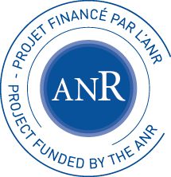

(PARSe, ANR-20-CE48-0001)

In this project we aim to study the foundations of processing large-scale, noisy string data. Our goal is to understand the limit of
computations, and to provide new ultra-efficient algorithms and data structures for processing such data, inspired by approaches in
hashing and high-dimensional geometry. We will focus on three research directions: streaming pattern matching, probabilistic text
indexing, and synopsis-based clustering of sequence data. Algorithms and data structures on strings have traditionally been
exploited in such fields as Bioinformatics, Information Retrieval, and Digital Security, and we expect our project to have a significant
impact on these fields.

## Members
* P. Gawrychowski (U. of Wrocław, Assistant Professor, member)
* G. Kucherov (LIGM, Senior CNRS Researcher, external member)
* P. Peterlongo (IRISA, Inria Research Associate, member)
* **T. Starikovskaya (ENS Paris, Assistant Professor, PI)**
* K. Swenson (LIRMM, Junior CNRS Researcher, member)

## PhDs and Postdocs
* G. Gourdel (PhD student, ENS Paris and U. Rennes)
* G. Bathie (PhD student, ENS Paris and U. Bordeaux)
* J. Ellert (Postdoc, ENS Paris)

## Summer School and Workshop
As a part of the project, we organised <a href="https://cpm2023.u-pem.fr/summer-school.html">the CPM summer school in 2023</a>  and a workshop <a href="https://conferences.cirm-math.fr/3086.html">"New Horizons of Stringology"</a> at Cirm in 2024. 

